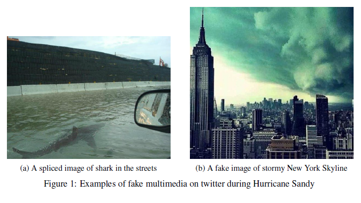
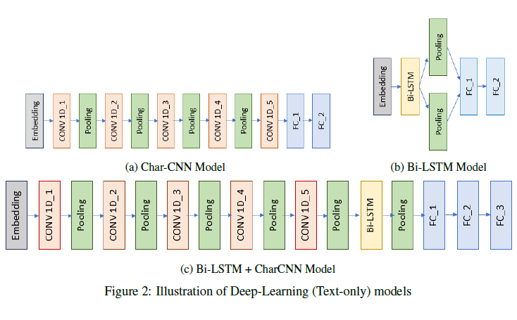
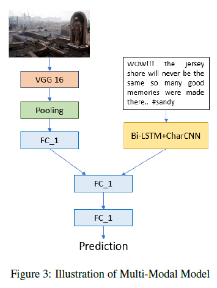
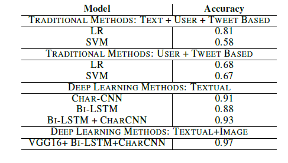

# Fake-News-Detection

## Introduction
With growing role of social media as critical components of information, emergency preparedness, response and recovery during disasters, an increased attention is needed to identify and counter the spread of false information and rumors in times of such public emergency. Almost all major disaster events in past few years, viz. Hurricane Sandy, Nepal Earthquake, Chennai floods etc. have witnessed rumors being spread virally on various social media platforms. Such false and incorrect information can lead to chaos and panic among people on the ground and have serious detrimental outcomes for public safety. While prior works have proposed automated techniques to detect false information online, these techniques primarily fail to look beyond the textual content. In this repository, I maintain the code of the experiments conducted with a multi-modal model that can detect the credibility of a post by effectively capturing the semantics of the text along with the features of associated piece of multimedia in it.

  

## Dataset
[MediaEval Dataset for Verifying Multimedia Use](http://www.multimediaeval.org/mediaeval2016/verifyingmultimediause/)

## Model

### Deep Learning (Text Only)

  

### Deep Learning (Multimodal approach)

  

## Results

  

## Report
You can read about the work in detail [here](Paper.pdf)

## Author
Shanya Sharma
